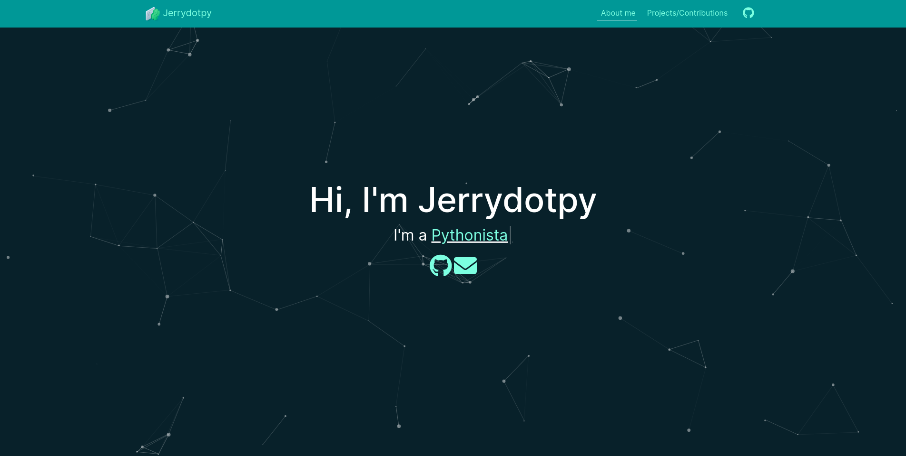
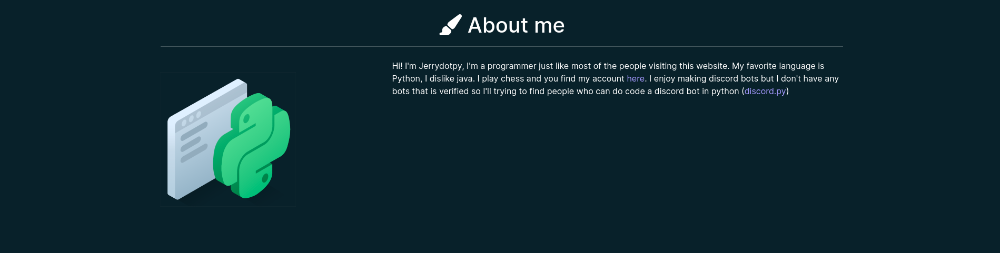
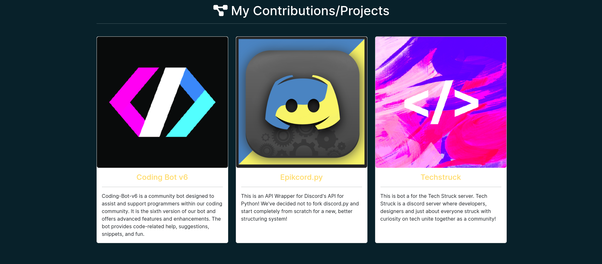

# [My portofolio](https://jerry-py.github.io)

| Nothing special here just my portofolio, created for fun:

This was created using:

| Module | Name |
| ------ | ---- |
| Bootstrap | https://getbootstrap.com/ |
| Particles.js | https://github.com/VincentGarreau/particles.js |
| Typed.js | https://github.com/mattboldt/typed.js |
| Animated.css | https://github.com/animate-css/animate.css |
| Font Awesome Icons | https://fontawesome.com/ |
| Google Font: Montserrat | https://fonts.google.com/ |

## [Landing Section](https://jerry-py.github.io)

## [About Section](https://jerry-py.github.io#about)

## [Contributions/Project](https://jerry-py.github.io/#projects)

